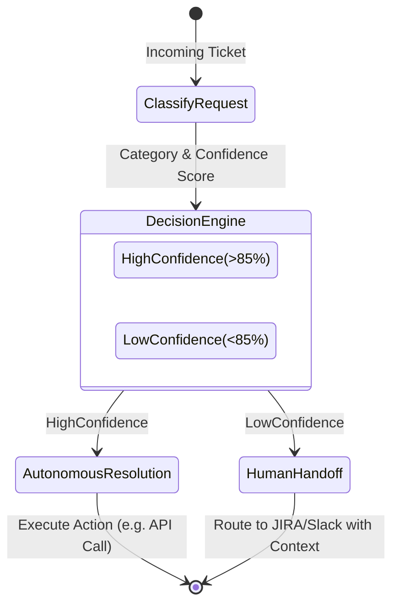

# AI Triage Agent

An agentic workflow built with LangGraph and the Anthropic Claude API, designed to autonomously classify, route, and resolve incoming stakeholder requests. 

This system was engineered to cut human handling time in operations queues by up to 80%. It achieves this by resolving high-confidence requests autonomously and formatting ambiguous cases with structured context before handing them off to human operators.

---

## Technical Architecture

The core of the AI Triage Agent is a state machine built using `LangGraph`. This cyclical graph architecture ensures deterministic routing based on LLM-derived confidence scores.



---

## Core Components

### 1. State Management (`src/agent/state.py`)
Utilizes a `TypedDict` to pass the `AgentState` between nodes. This state tracks the raw request, the evolving classification, the LLM's confidence threshold, and any structured entities extracted during the process.

### 2. Node Execution (`src/agent/nodes.py`)
- **Classify**: Employs the Claude API to perform intent recognition and entity extraction, generating a confidence score representing the ambiguity of the request.
- **Resolve**: For high-confidence queries (e.g., standard access requests, known bug reports), this node prepares the autonomous resolution payload.
- **Handoff**: For complex or ambiguous queries, this node extracts relevant keywords and context, formatting the ticket to minimize the cognitive load on the human operator who receives it.

### 3. Graph Compilation (`src/agent/graph.py`)
Defines the conditional edges of the workflow. The routing logic explicitly evaluates the `confidence_score` attribute to branch execution either toward the `resolve` node or the `handoff` node.

---

## Implementation & Iteration Strategy

The initial version of this architecture was shipped in just three days. It was then refined over four weekly improvement cycles:
1. **Feedback Ingestion**: Analyzed failure cases where the agent's confidence was incorrectly high.
2. **Few-Shot Prompting**: Updated the classifier prompts with specific examples of these failure cases.
3. **Threshold Tuning**: Adjusted the confidence threshold to reach a 90% autonomous resolution rate without full architectural rebuilds.

---

## Setup & Execution

### Installation
```bash
git clone https://github.com/manavanandani/AITriageAgent.git
cd AITriageAgent
pip install -r requirements.txt
```

### Running the Demo
The demo script instantiates the LangGraph workflow and processes an array of test requests, demonstrating the conditional routing logic.
```bash
python3 main.py
```

---

## License
Copyright (c) 2026 Manav Anandani. Licensed under the MIT License.
